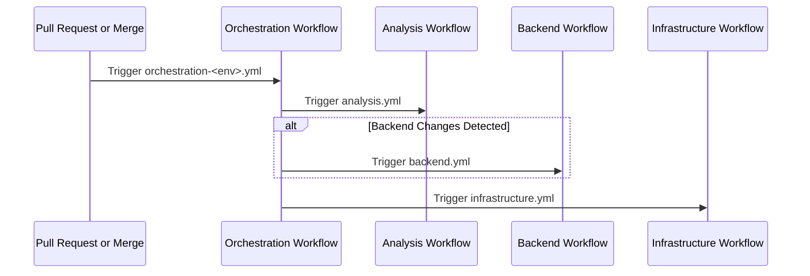

  
# Zero Trust Maturity Framework (ZTMF) Scoring

The ZTMF Scoring Application allows ADOs to answer HHS Zero Trust data calls, and view their Zero Trust Maturity score online.

This repo contains the following major components:
- `.github/workflows` contains workflows for Github Actions to test, build, and deploy to AWS
- `backend/` includes a REST API and an ETL process both written in Go
- `infrastructure/` includes all AWS resources as IaC managed by Terraform

## Required Tools

1. [Go](https://go.dev/) at the required version specified in [backend/go.mod](backend/go.mod#L3)
2. PostgreSQL management tool of your choice such as [pgAdmin](https://www.pgadmin.org/)
3. [AWS CLI](https://docs.aws.amazon.com/cli/latest/userguide/getting-started-install.html) for establishing SSM tunnels
4. [Terraform](https://developer.hashicorp.com/terraform/install?product_intent=terraform) for deploying infrastructure changes manually if necessary (though CICD should handle most changes)
5. [Docker](https://www.docker.com/) for building the container image (though CICD should handle most changes)
6. [Emberfall](https://github.com/aquia-inc/emberfall) for running smoke tests locally (very helpful when adding new routes or parameters)

## Architecture

The ZTMF Scoring Application is comprised of a React-based Single-Page Application (SPA) that retrieves data from a REST API. The web assets for the SPA are hosted in an S3 bucket, and the API is hosted as an ECS service with containers deployed via Fargate behind an application load balancer. CloudFront provides the entrypoint with caching enabled for static assets, and a WAF for geofencing and other security measures. The database is provided by AWS Aurora Serverless V2 PostgreSQL.

## Backend

The backend is a REST API written in Go. See [backend/README](backend/README.md)

## Infrastructure

The infrastructure is managed by Terraform. See [infrastructure/README](infrastructure/README.md)

## CI/CD Workflows

The project uses GitHub Actions for continuous integration and deployment. The workflows are organized into modular components that are orchestrated differently for development and production environments. GitHub Secrets secures sensitive values, and authentication to AWS is provided via OIDC to an IAM IDP.

### Workflow Components

1. **Analysis (`analysis.yml`)**
   - Performs code quality and security checks
   - Lints Go code using staticcheck
   - Lints Terraform code using tflint
   - Runs Snyk security scans for Go code and infrastructure as code

2. **Backend (`backend.yml`)**
   - Builds and tests the backend service
   - Creates a Docker image for the backend
   - Runs security scanning on the Docker image
   - Performs smoke tests using [Emberfall](https://github.com/aquia-inc/emberfall)
   - Pushes the image to ECR
   - Updates SSM parameter with the new image tag

3. **Infrastructure (`infrastructure.yml`)**
   - Deploys AWS infrastructure using Terraform
   - Configures environment-specific settings
   - Applies Terraform changes with auto-approve

### Orchestration

The workflows are orchestrated differently based on the environment:

**Development Environment (`orchestration-dev.yml`)**
- Triggered on pull requests to the main branch
- Runs analysis on all PRs
- For non-draft PRs, checks for changes in the backend code
- If backend changes are detected, runs the backend workflow for DEV
- Finally runs the infrastructure workflow for DEV

**Production Environment (`orchestration-prod.yml`)**
- Triggered when a pull request to main is merged (closed with merge)
- Runs analysis, backend, and infrastructure workflows sequentially for PROD
- Only executes if the PR was actually merged

### Workflow Sequence Diagram

## User Interface 

ZTMF UI has its own [repository](https://github.com/cms-enterprise/ztmf-ui).
