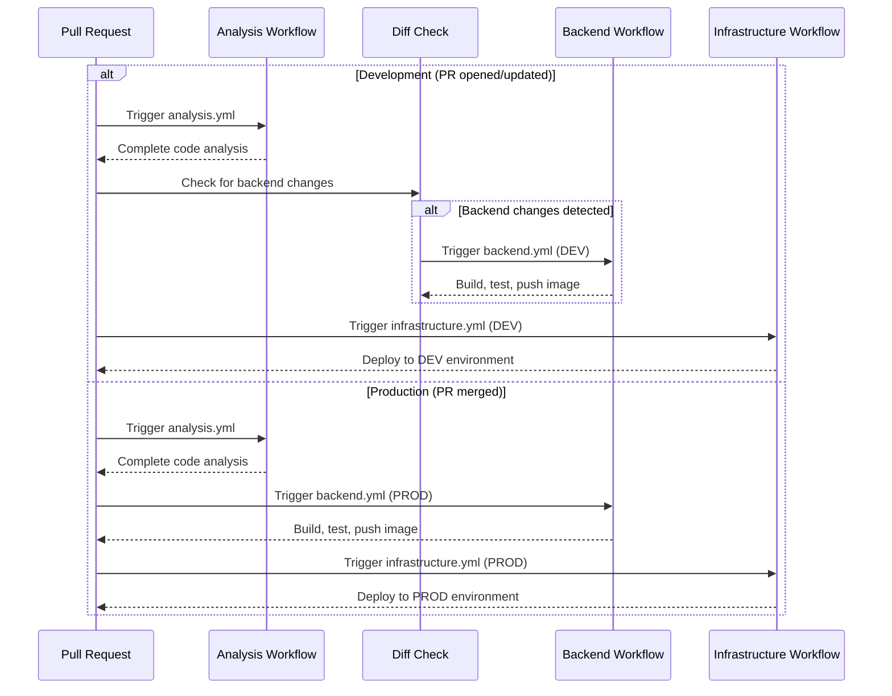

  
# Zero Trust Maturity Framework (ZTMF) Scoring

The ZTMF Scoring Application allows ADOs to view their Zero Trust Maturity score online. An upcoming release will allow new ADOs to answer the questionnaire from scratch, and existing ADOs to update their answers, all within a web-based interface. The interface and the API are protected by AWS Verified Access which requires authentication via IDM (Okta).

This monorepo contains the following major components:
- `backend/` includes a REST API and an ETL process both written in Go
- `infrastructure/` includes all AWS resources as IaC managed by Terraform
- `.github/workflows` contains workflows for Github Actions to test, build, and deploy to AWS

## Architecture

The ZTMF Scoring Application is comprised of a React-based Single-Page Application (SPA) that retrieves data from a REST API. The web assets for the SPA are hosted in an S3 bucket, and the API is hosted as an ECS service with containers deployed via Fargate.

## CI/CD Workflows

The project uses GitHub Actions for continuous integration and deployment. The workflows are organized into modular components that are orchestrated differently for development and production environments.

### Workflow Components

1. **Analysis (`analysis.yml`)**
   - Performs code quality and security checks
   - Lints Go code using staticcheck
   - Lints Terraform code using tflint
   - Runs Snyk security scans for Go code, source code, and infrastructure as code

2. **Backend (`backend.yml`)**
   - Builds and tests the backend service
   - Creates a Docker image for the backend
   - Runs security scanning on the Docker image
   - Performs smoke tests using [Emberfall](https://github.com/aquia-inc/emberfall)
   - Pushes the image to ECR and updates SSM parameter with the new image tag

3. **Infrastructure (`infrastructure.yml`)**
   - Deploys AWS infrastructure using Terraform
   - Configures environment-specific settings
   - Applies Terraform changes with auto-approve

### Orchestration

The workflows are orchestrated differently based on the environment:

**Development Environment (`orchestration-dev.yml`)**
- Triggered on pull requests to the main branch
- Runs analysis on all PRs
- For non-draft PRs, checks for changes in the backend code
- If backend changes are detected, runs the backend workflow for DEV
- Finally runs the infrastructure workflow for DEV

**Production Environment (`orchestration-prod.yml`)**
- Triggered when a pull request to main is merged (closed with merge)
- Runs analysis, backend, and infrastructure workflows sequentially for PROD
- Only executes if the PR was actually merged

### Workflow Sequence Diagram

## User Interface 

ZTMF UI has its own [repository](https://github.com/cms-enterprise/ztmf-ui).
