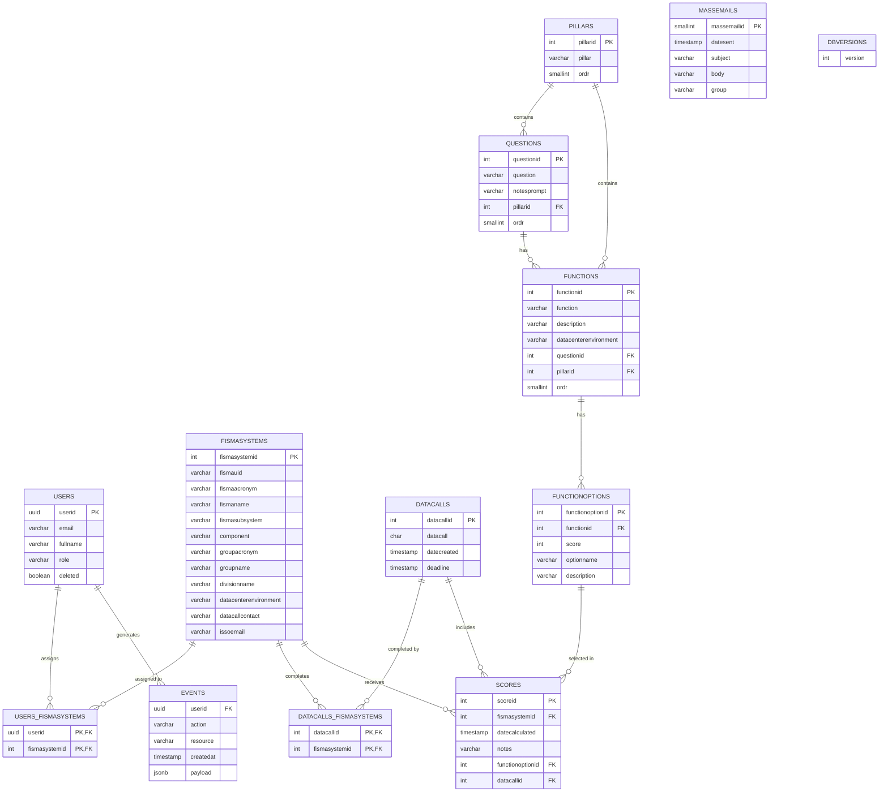
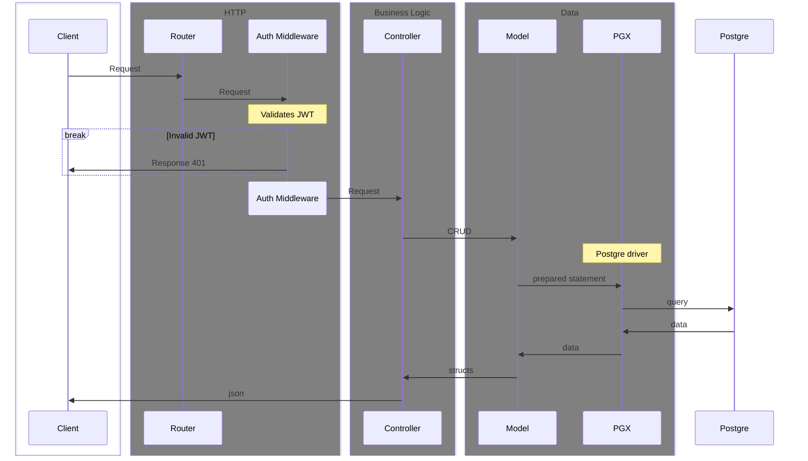

# Backend

The backend is comprised of a REST API and an ETL process both written in Go.

## Developer Requirements

- Go ~>1.24.1
- Docker buildx


## Directory Structure

The backend is organized in a clean, modular structure that supports multiple binaries sharing common packages such as config and db abstractions:

<!-- using shell syntax just for the colors -->
```sh
backend/
├─ cmd/                        # multiple binaries where each subfolder is a separately compiled binary
│  └─ api/
│     ├─ main.go               # entry point for API binary
│     └─ internal/             # Packages internal to the api
│        ├─ auth/              # Authentication and authorization
│        │  ├─ middleware.go   # JWT validation middleware
│        │  └─ token.go        # JWT token handling
│        ├─ controller/        # HTTP request handlers
│        │  ├─ controller.go   # Common controller functionality
│        │  ├─ errors.go       # Error definitions
│        │  └─ [resource].go   # Resource-specific controllers
│        ├─ mail/              # Email sending functionality
│        │  └─ mail.go
│        ├─ migrations/        # Database schema migrations
│        │  ├─ migrations.go   # Migration runner
│        │  ├─ populate.go     # Test data population
│        │  └─ [####][name].go # Numbered migration files
│        ├─ router/            # API route configurations
│        └─ spreadsheet/       # Spreadsheet generation (.xlsx files)
└─ internal/                   # internal components shared between binaries
   ├─ config/                  # common config, environment variable parsing
   ├─ db/                      # wrapper around db connection handling via pgx (postgre adapter)
   ├─ model/                   # Data models and database operations
   │  ├─ model.go              # Common model functionality
   │  ├─ model.go              # Common model functionality
   │  └─ [resource].go         # Resource-specific models
   └─ secrets/                 # Utility wrapper around AWS Secrets Manager SDK
```

## Shared Components

This codebase is organized to allow for multiple binaries to share the same common modules:

- `config` which parses environment variables into a struct
- `db` which provides access to the PostgreSQL driver `pgx`
- `model` which provides abstracted utility methods for accessing resources in the database 
- `secrets` which provides an abstracted high level utility for retriving the values from AWS Secrets Manager

### Config (config/)

The config package implements a singleton pattern for application configuration:

- `config.go` - Provides environment variable parsing and configuration access
- Uses the `github.com/caarlos0/env/v10` package to parse environment variables
- Implements AWS Secrets Manager integration for sensitive configuration
- Provides a thread-safe singleton instance via `GetInstance()`

The application uses a singleton configuration pattern that loads settings from environment variables. Configuration is managed through the `config` package located at `backend/internal/config/config.go`.

#### Configuration Loading

Configuration is loaded once at application startup and made available through the `config.GetInstance()` function. The configuration is parsed from environment variables using the `github.com/caarlos0/env/v10` package.

#### Available Configuration Options

##### Core Settings
- `ENVIRONMENT` - Application environment (default: "production"). Set to "local" for local dev auto-user creation.
- `PORT` - HTTP server port (default: "3000")
- `CERT_FILE` - Path to TLS certificate file
- `KEY_FILE` - Path to TLS key file
- `AWS_REGION` - AWS region for services (default: "us-east-1")

##### Authentication Settings
- `AUTH_HS256_SECRET` - Secret for HS256 JWT signing
- `AUTH_TOKEN_KEY_URL` - URL to fetch the JWT validation key
- `AUTH_HEADER_FIELD` - HTTP header field containing the JWT token

##### Database Settings
- `DB_ENDPOINT` - Database host
- `DB_PORT` - Database port (default: "5432")
- `DB_NAME` - Database name
- `DB_USER` - Database username
- `DB_PASS` - Database password
- `DB_SECRET_ID` - AWS Secrets Manager ID for database credentials
- `DB_POPULATE` - Path to SQL file for populating test data

##### SMTP Settings
SMTP configuration can be loaded either from environment variables or from AWS Secrets Manager:

Environment variables:
- `SMTP_USER` - SMTP username
- `SMTP_PASS` - SMTP password
- `SMTP_HOST` - SMTP server host
- `SMTP_PORT` - SMTP server port
- `SMTP_FROM` - Email sender address

AWS Secrets Manager:
- `SMTP_CONFIG_SECRET_ID` - Secret ID for SMTP configuration
- `SMTP_CA_ROOT_SECRET_ID` - Secret ID for SMTP root certificate
- `SMTP_CA_INT_SECRET_ID` - Secret ID for SMTP intermediate certificate

#### Configuration Example

For local development, you can create a `.env` file or use the provided `compose.env-example` as a template:

```sh
# Core settings
ENVIRONMENT=local
PORT=3000

# Authentication
AUTH_HEADER_FIELD=HS256
AUTH_HS256_SECRET=your-secret-key

# Database
DB_ENDPOINT=localhost
DB_PORT=5432
DB_NAME=ztmf
DB_USER=postgres
DB_PASS=postgres
DB_POPULATE=./_test_data.sql

# SMTP (optional for local development)
SMTP_HOST=smtp.example.com
SMTP_PORT=587
SMTP_USER=user@example.com
SMTP_PASS=password
SMTP_FROM=noreply@example.com
```

#### AWS Secrets Integration

The configuration system integrates with AWS Secrets Manager for sensitive information:

1. Database credentials can be stored in a secret specified by `DB_SECRET_ID`
2. SMTP configuration can be stored in a secret specified by `SMTP_CONFIG_SECRET_ID`
3. SMTP certificates can be loaded from secrets specified by `SMTP_CA_ROOT_SECRET_ID` and `SMTP_CA_INT_SECRET_ID`

This approach allows for secure management of credentials in non-local environments.

### Model (model/)

Model package represent database entities and data handling operations:

- `model.go` - Provides database connection handling and query execution
- Resource-specific models define entity structures and read/write operations
- Uses the `squirrel` library for SQL query building
- Implements a repository pattern for data access

#### Event Tracking

The data model includes an `events` table and related Go structs in `model/events.go` for automatically recording all write operations to resources. All resource models (eg `model/users.go`) leverage the `queryRow` function for all write operations, namely `insert` and `update` since no true `delete` is ever performed. The `queryRow` function, upon successful insert or update, will then call `recordEvent` function which uses the provided `SqlBuilder` argument to determine what write operation was performed (create, update, delete), and records that along with current user ID, the resource being acted upon, and the payload for the event. The event payload is essentially the respective resource's row that was inserted or updated, stored in the events table payload column as JSONB. This processes enables automatic capture of all write operations without needing to explicitly record events or even pre-define resources.

Furthermore, events has a read-only route in the API see `backend/cmd/api/internal/router/router.go` for listing events with filters if provided, see `backend/cmd/api/internal/controller/events.go`

## Multiple Binaries

The backend supports multiple compiled binaries sharing common packages:

### API Binary (`cmd/api/`)
The REST API server for the ZTMF web application.

### Lambda Binary (`cmd/lambda/`)
Automated data synchronization from PostgreSQL to Snowflake:
- **Runtime**: AWS Lambda with Go (`provided.al2` runtime)
- **Function**: Quarterly data sync to Snowflake for business intelligence
- **Environment**: Dry-run in dev, real sync in production
- **Tables**: 10 core ZTMF business tables synchronized

#### Lambda Development
```bash
# Build Lambda locally
go build -o bootstrap ./cmd/lambda/.

# Build for AWS Lambda (static linking)
CGO_ENABLED=0 GOOS=linux GOARCH=amd64 go build -a -ldflags '-extldflags "-static"' -o bootstrap ./cmd/lambda/.

# Test locally (dry-run mode)
ENVIRONMENT=local go run ./cmd/lambda/...
```

#### Lambda Architecture
- **Handler**: Event-driven execution (manual, scheduled)
- **PostgreSQL Export**: Real data extraction using pgx driver
- **Snowflake Loading**: RSA authentication with transaction rollback
- **Shared Packages**: Reuses `internal/config`, `internal/secrets`

### Compilation
To compile binaries for distribution, run `go build -o ./ ./cmd/{binary}/...`. The API binary is containerized via [Dockerfile](./Dockerfile), while the Lambda binary is deployed as a ZIP package via CI/CD.

## API Components

### Main Application (main.go)

The entry point for the API server that:
- Initializes configuration
- Runs database migrations
- Sets up the HTTP server with TLS if configured
- Registers the router

### Router (router.go)

Defines all API endpoints using the [Gorilla Mux](https://github.com/gorilla/mux) router. The API follows RESTful conventions with endpoints organized by resource:

- `/api/v1/datacalls` - Data call management
- `/api/v1/fismasystems` - FISMA system management
- `/api/v1/users` - User management
- `/api/v1/scores` - Score management
- `/api/v1/questions` - Question management
- `/api/v1/functions` - Function management
- `/api/v1/events` - Event tracking

The router applies the authentication middleware to all routes.

### Authentication (auth/)

Authentication is handled via JWT tokens:

- `middleware.go` - Validates JWT tokens from request headers
- `token.go` - Handles JWT token decoding and validation

For non-local environments tokens will be provided by IDM via Okta via the OIDC integration with the AWS Application load balancer. For local development, the `Authorization` header will be the default, and `AUTH_HEADER_FIELD` should be set to `HS256`

### Controllers (controller/)

Controllers handle HTTP requests and responses:

- `controller.go` - Provides common functionality like JSON response handling and error sanitization
- Resource-specific controllers implement CRUD operations for each resource type
- Controllers follow a consistent pattern of extracting parameters, calling model methods, and responding with data or errors

#### Query Parameter Handling

Controllers use the Gorilla Schema package to decode URL query parameters into Go structs. The `decoder` variable is a shared instance of the schema decoder that's used across all controllers. It converts URL query parameters into structured input objects:

```go
// Example from GetDatacallExport in datacalls.go
findAnswersInput := model.FindAnswersInput{}
err := decoder.Decode(&findAnswersInput, r.URL.Query())
```

This approach provides several benefits:
- Type-safe handling of query parameters
- Automatic validation and conversion of parameter types
- Consistent parameter handling across controllers
- Support for complex filtering and pagination parameters

The decoder is initialized once and shared across all controllers because it caches struct metadata for performance.

### Migrations (migrations/)

Database schema migrations are managed through numbered migration files:

- `migrations.go` - Runs migrations on application startup
- Uses the `tern` library for PostgreSQL migrations
- Migrations are executed in lexical filename order
- Can populate test data in local development environments

## Data Flow

1. HTTP requests are received by the server
2. Requests pass through the authentication middleware
3. The router directs requests to the appropriate controller
4. Controllers validate input and call model methods
5. Models interact with the database and return results
6. Controllers format responses and handle errors
7. HTTP responses are sent back to the client

## Key Design Patterns

### Middleware Pattern
   - Intercepts HTTP requests before they reach the handler
   - Implements cross-cutting concerns like authentication, logging, and error handling
   - Uses Go's http.Handler interface for chaining middleware
   - Example: `auth/middleware.go` validates JWT tokens and adds the user to the request context
   - Benefits:
     - Separates cross-cutting concerns from business logic
     - Allows for reusable components across different routes
     - Maintains clean controller code focused on business logic

### Repository Pattern
   - Separates data access logic from business logic
   - Each model file acts as a repository for a specific entity
   - Provides methods like `Find`, `Save`, etc. that abstract away SQL queries
   - Controllers interact with repositories instead of directly with the database
   - Makes the code more testable by allowing mock repositories in tests
   - Centralizes data access code, reducing duplication
   - Example: `model/fismasystems.go` provides `FindFismaSystems()` and `FindFismaSystem()` methods that handle the SQL queries and return domain objects

### Dependency Injection
   - Provides components with their dependencies rather than having them create dependencies
   - Uses context.Context to pass dependencies like the authenticated user
   - Configuration is injected via the config package singleton
   - Database connections are injected into model methods
   - Benefits:
     - Decouples components for better testability
     - Centralizes configuration management
     - Allows for easier mocking in tests
     - Example: `model.UserFromContext(r.Context())` extracts the authenticated user from the request context

### Error Handling Pattern
   - Centralizes error handling in the controller package
   - Maps domain/model errors to appropriate HTTP status codes
   - Uses custom error types for specific error conditions
   - Provides consistent error responses across all endpoints
   - Implementation:
     - `controller.respond()` handles formatting all responses
     - `controller.sanitizeErr()` maps errors to HTTP status codes
     - Custom error types like `model.InvalidInputError` provide structured error data
     - Controllers use early returns for error conditions
     - Example: When a model returns `model.ErrNoData`, it's translated to a 404 Not Found response

## Database Schema

The application uses a PostgreSQL database with tables for:

- `users` - Application users
- `fismasystems` - FISMA systems being evaluated
- `datacalls` - Data collection events
- `questions` - Assessment questions
- `functions` - Zero trust functions being evaluated
- `functionoptions` - Possible answers for functions
- `scores` - Recorded scores for function evaluations
- `pillars` - Organizational pillars for questions and functions
- `events` - Audit trail of user actions
- Junction tables for many-to-many relationships:
  - `users_fismasystems` - User assignments to FISMA systems
  - `datacalls_fismasystems` - FISMA systems that have completed data calls




## Getting Started

To work with this codebase:

1. Understand the domain model and database schema
2. Familiarize yourself with the API endpoints in `router.go`
3. Follow existing patterns when adding new features
4. Add database changes through migrations
5. Run tests via Emberfall to ensure your changes don't break existing functionality

### Common Tasks

#### Adding a New API Endpoint

1. Add the route in `router.go`
2. Create or update the controller method
3. Implement any required model methods
4. Test the endpoint

#### Adding a Database Change

1. Create a new migration file, numbered accordingly, in `migrations/`
2. Implement the schema change
3. Update affected models
4. Test the migration and model changes

## TLS
The API is designed to serve with TLS when a certificate and key are provided, or serve unsecured http when not provided (useful for local development). The Dockerfile will generate a self-signed certificate which is fine since the containers are behind an AWS application load balancer which accepts untrusted certificates. Certificates for dev and prod environments are acquired from DigiCert and manually imported into AWS ACM.


## API Architecture & Request/Response Flow




## Docker

`Dockerfile` is a multi-stage build written to begin with a Debian-based image with Go and Go tools installed, and the second stage is `FROM scratch` to reduce the final image size to absolute minimum. OpenSSL is used to generate self-signed certificates to be used to run the API with `HTTP.ListenAndServeTLS` to acheive end-to-end encryption.

Final images are tagged with the current commit SHA, pushed to the ECR private registry, and the commit SHA is then stored in an SSM Parameter so that Terraform can use that when it deploys a new container to ECS.
