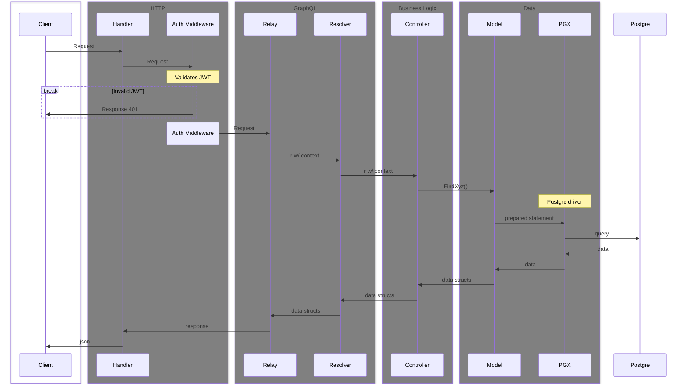

# Backend

The backend is comprised of a GraphQL API and an ETL process both written in Go.

## Developer Requirement and Config

- Go ~>1.22.0
- Docker buildx

## Application Architecture

- `cmd/` contains code compiled as separate binaries
  - `api/` the graphql API
  - `elt` the etl process to pull score from csv into postgre
- `internal/` contains libraries common to both binaries
  - `config/` pulls api and db settings from environment variables
  - `db/` is a lite wrapper around pgx that handles passing config and returning a db connection
  - `secrets/` is a lite wrapper around AWS secrets manager sdk to cache and refresh secrets that could potentially be rotated while a process is running

### GraphQL API

GraphQL was chosen because the primary purpose of this API is to drive the UI (see `ui/`). While REST APIs are popular and still make sense for some use cases, they often lead to the UI client making more requests than necessary and retrieving more data than necessary (aka "overfetching"). GraphQL is also faster and easier to develop when developing specifically for driving a UI.

GraphQL functionality is provided by [github.com/graph-gophers/graphql-go](github.com/graph-gophers/graphql-go) with `main.go` providing intial bootstrapping of the lib along with the necessary http listener.

#### TLS
The API is designed to serve with TLS when a certificate and key are provided, or serve unsecured http when not provided (useful for local development). The Dockerfile will generate a self-signed certificate which is fine since the containers are behind an AWS application load balancer which accepts untrusted certificates.

#### Code Organization
- `main.go` bootstraps HTTP server and GraphQL relay
- `internal/` keeps the following packages from being imported by other projects
  - `auth/` handles JWT token decoding/validation, user claims, and middleware
  - `controller/` encapsulates business logic and authorization rules, bridges graph resolvers and model
  - `graph/` contains the GraphQL schema and resolvers
  - `model/` handles data and DB calls

#### API Architecture & Request/Response Flow

### Docker

`Dockerfile` is a multi-stage build written to begin with a Debian-based image with Go and Go tools installed, and the second stage is `FROM scratch` to reduce the final image size to absolute minimum. OpenSSL is used to generate self-signed certificates to be used to run the API with `HTTP.ListenAndServeTLS` to acheive end-to-end encryption.

Final images are tagged with the current commit SHA, pushed to the ECR private registry, and the commit SHA is then stored in an SSM Parameter so that Terraform can use that when it deploys a new container to ECS.
