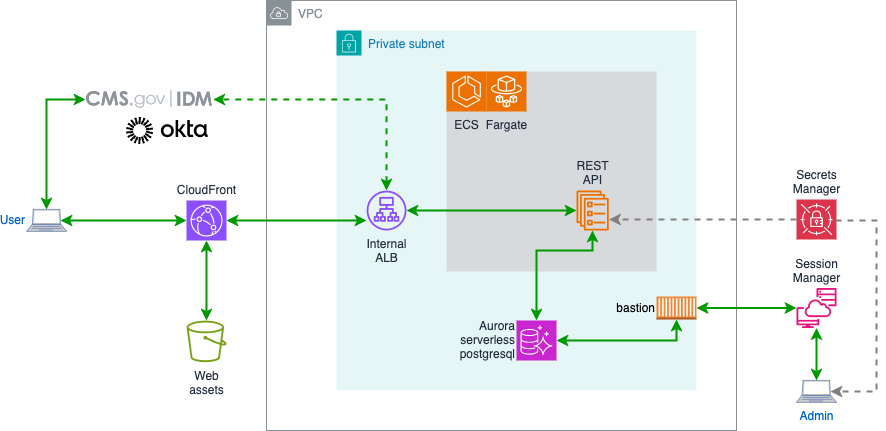
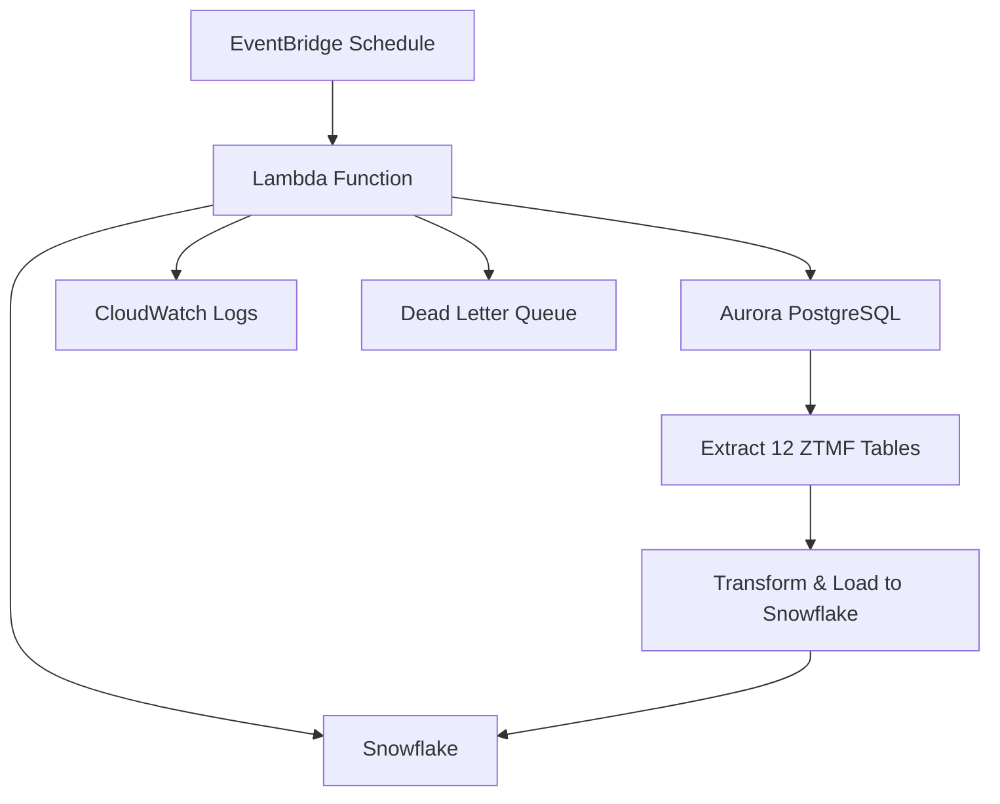

# ZTMF Infrastructure

This directory contains the Terraform configuration for the ZTMF (Zero Trust Maturity Framework) application infrastructure on AWS. The infrastructure is deployed in the `us-east-1` region with separate environments for `dev` and `prod`, each in its own AWS account. 

> **_NOTE:_** For now the assets and api are both behind CloudFront (protected with CMS Cloud-provided WAF), but should be migrated to AWS Verified Access once the service is approved and made available for use in the production account.



The ZTMF application follows a modern cloud-native architecture with the following key components:

## Key Components

### Frontend
- **CloudFront Distribution**: Serves static web assets and proxies API requests
- **S3 Bucket**: Stores static web assets (HTML, CSS, JS)
- **WAF**: Web Application Firewall provided by CMS Cloud

### Backend
- **Internal ALB**: Application Load Balancer with OIDC authentication (via IDM Okta)
- **ECS Cluster**: Runs the API container using Fargate (serverless)
- **ECR Repository**: Stores the API container images
- **Aurora PostgreSQL**: Serverless v2 database for application data
- **Secrets Manager**: Stores credentials, certificates, and other sensitive information

### Data Synchronization
- **Lambda Function**: Automated data sync from PostgreSQL to Snowflake
- **EventBridge**: Scheduled execution (quarterly prod, weekly dev)
- **S3 Bucket**: Lambda deployment package storage
- **CloudWatch**: Monitoring, logging, and alerting for sync operations

### Networking
- **VPC**: Provided by CMS Cloud
- **Private Subnets**: Host all application components
- **VPC Endpoints**: Allow private access to AWS services
- **Security Groups**: Control traffic between components

### Access & Authentication
- **OIDC Authentication**: Integrated with the ALB for user authentication
- **IAM Roles**: Defined with appropriate permissions for each component
- **GitHub Actions OIDC**: Enables CI/CD workflows

## State Management

State is stored in S3 buckets, with each environment having its own bucket and state store.
To switch environments, initialize Terraform with the appropriate backend config:

```bash
terraform init -backend-config="config/backend-<env>.tf" -reconfigure
```

Where `<env>` is one of `dev` or `prod`. See files in `infrastructure/config/`.

## Variables

Input variables are defined in `variables.tf` and environment-specific values are in `tfvars/<env>.tfvars`.
To apply with the correct variables:

```bash
terraform <plan|apply> -var-file="tfvars/<env>.tfvars"
```

## Custom Modules

### IAM Role Module

A custom module is used as a factory for IAM roles. CMS requires that all IAM roles include a `path` and `permissions_boundary`. These are expressed in `modules/role/main.tf` and all roles created for use by the application are created by calling the module:

```hcl
module <identifier> {
  name                = <name>
  source              = "./modules/role"
  principal           = { Service = "ecs-tasks.amazonaws.com" } // example
  ...
}
```

## Security Features

- **HTTPS Only**: All traffic is encrypted in transit
- **Private Networking**: All application components run in private subnets
- **WAF Protection**: CloudFront distribution is protected by CMS Cloud WAF
- **OIDC Authentication**: Users are authenticated via OIDC
- **Secrets Management**: Sensitive information is stored in AWS Secrets Manager
- **Geo Restriction**: CloudFront distribution is restricted to US locations only
- **Content Security Policy**: Strict CSP headers are applied to all responses

## Deployment

The infrastructure is deployed using Terraform and GitHub Actions. The GitHub Actions workflow is configured to use OIDC for authentication with AWS.

## Data Synchronization

### Lambda Function for Snowflake Sync

The ZTMF application includes automated data synchronization from PostgreSQL to Snowflake using AWS Lambda:

#### Architecture
- **Function**: `ztmf-data-sync-${environment}` 
- **Runtime**: Go (`provided.al2`) with 1GB memory, 15-minute timeout
- **VPC**: Deployed in private subnets with access to Aurora PostgreSQL
- **Scheduling**: EventBridge rules for automated execution
- **Monitoring**: CloudWatch logs, metrics, and alarms

#### Execution Schedule
- **Production**: Quarterly on 1st of every 3rd month at 2 AM UTC
- **Development**: Weekly on Mondays at 9 AM UTC (dry-run mode only)

#### Data Flow


#### Tables Synchronized
The Lambda synchronizes all core ZTMF tables:
- `datacalls` → `ZTMF_DATACALLS`
- `fismasystems` → `ZTMF_FISMASYSTEMS`
- `users` → `ZTMF_USERS`
- `scores` → `ZTMF_SCORES`
- `events` → `ZTMF_EVENTS`
- And 7 additional junction and reference tables

#### Security & Configuration
- **Secrets Manager**: Environment-specific Snowflake credentials
- **IAM Roles**: Least privilege access to database, secrets, and VPC
- **Error Handling**: Dead letter queue and CloudWatch alarms
- **Environment Isolation**: Dry-run in dev, real sync in production

## Database Access

A bastion host is provided for database administration. The bastion host is accessible via AWS Systems Manager Session Manager and has access to the database.
