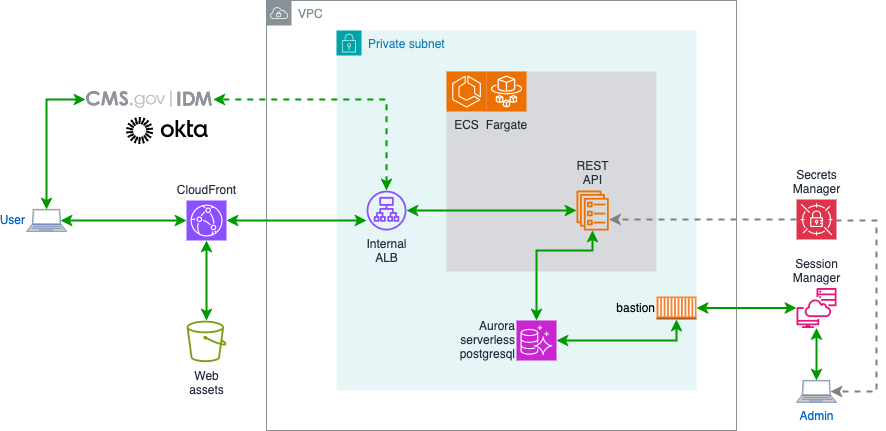

# ZTMF Infrastructure

This directory contains the Terraform configuration for the ZTMF (Zero Trust Maturity Framework) application infrastructure on AWS. The infrastructure is deployed in the `us-east-1` region with separate environments for `dev` and `prod`, each in its own AWS account. 

> **_NOTE:_** For now the assets and api are both behind CloudFront (protected with CMS Cloud-provided WAF), but should be migrated to AWS Verified Access once the service is approved and made available for use in the production account.



The ZTMF application follows a modern cloud-native architecture with the following key components:

## Key Components

### Frontend
- **CloudFront Distribution**: Serves static web assets and proxies API requests
- **S3 Bucket**: Stores static web assets (HTML, CSS, JS)
- **WAF**: Web Application Firewall provided by CMS Cloud

### Backend
- **Internal ALB**: Application Load Balancer with OIDC authentication (via IDM Okta)
- **ECS Cluster**: Runs the API container using Fargate (serverless)
- **ECR Repository**: Stores the API container images
- **Aurora PostgreSQL**: Serverless v2 database for application data
- **Secrets Manager**: Stores credentials, certificates, and other sensitive information

### Data Synchronization
- **Lambda Function**: Automated data sync from PostgreSQL to Snowflake
- **EventBridge**: Scheduled execution (quarterly prod, weekly dev)
- **S3 Bucket**: Lambda deployment package storage
- **CloudWatch**: Monitoring, logging, and alerting for sync operations

### Networking
- **VPC**: Provided by CMS Cloud
- **Private Subnets**: Host all application components
- **VPC Endpoints**: Allow private access to AWS services
- **Security Groups**: Control traffic between components

### Access & Authentication
- **OIDC Authentication**: Integrated with the ALB for user authentication
- **IAM Roles**: Defined with appropriate permissions for each component
- **GitHub Actions OIDC**: Enables CI/CD workflows

## State Management

State is stored in S3 buckets, with each environment having its own bucket and state store.
To switch environments, initialize Terraform with the appropriate backend config:

```bash
terraform init -backend-config="config/backend-<env>.tf" -reconfigure
```

Where `<env>` is one of `dev` or `prod`. See files in `infrastructure/config/`.

## Variables

Input variables are defined in `variables.tf` and environment-specific values are in `tfvars/<env>.tfvars`.
To apply with the correct variables:

```bash
terraform <plan|apply> -var-file="tfvars/<env>.tfvars"
```

## Custom Modules

### IAM Role Module

A custom module is used as a factory for IAM roles. CMS requires that all IAM roles include a `path` and `permissions_boundary`. These are expressed in `modules/role/main.tf` and all roles created for use by the application are created by calling the module:

```hcl
module <identifier> {
  name                = <name>
  source              = "./modules/role"
  principal           = { Service = "ecs-tasks.amazonaws.com" } // example
  ...
}
```

## Security Features

- **HTTPS Only**: All traffic is encrypted in transit
- **Private Networking**: All application components run in private subnets
- **WAF Protection**: CloudFront distribution is protected by CMS Cloud WAF
- **OIDC Authentication**: Users are authenticated via OIDC
- **Secrets Management**: Sensitive information is stored in AWS Secrets Manager
- **Geo Restriction**: CloudFront distribution is restricted to US locations only
- **Content Security Policy**: Strict CSP headers are applied to all responses

## Deployment

The infrastructure is deployed using Terraform and GitHub Actions. The GitHub Actions workflow is configured to use OIDC for authentication with AWS.

## Data Synchronization

PostgreSQL to Snowflake enrichment sync and the CFACTS pipeline live in the
private `CMS-Enterprise/ztmf-insights` repo. The insights stack writes the
generic `public.system_enrichment` table that ztmf core owns; ztmf exposes the
read endpoint at `GET /api/v1/systemenrichment/{fisma_uuid}`. The ztmf account
no longer hosts enrichment compute.

## Infrastructure Organization

The Terraform configuration follows a logical service-based organization:

- **`lambda-cert-rotation.tf`**: TLS cert rotation Lambda for the ALB cert
- **`lambda-kion.tf`**: Kion API key rotation Lambda
- **`iam-cert-rotation.tf`**, **`iam-kion.tf`**: per-Lambda IAM roles and policies
- **`monitoring-cert-rotation.tf`**, **`monitoring-kion.tf`**: per-Lambda log groups, alarms, DLQs
- **`s3.tf`**: S3 buckets (web assets, logs, lambda deployment packages, cert rotation archive)
- **`vpc.tf`**: Network resources including the shared Lambda security group
- **`secrets.tf`**: Secrets Manager resources for ALB OIDC, TLS, SMTP, Aurora master user, Kion API key
- **`outputs.tf`**: Terraform outputs (NAT egress IP, CloudFront distribution, ALB DNS)

## Database Access

Aurora is reached via an on-demand Fargate ops task (`ztmf_ops` task definition,
defined in `ecs.tf`). There is no long-running bastion. Operators launch the
task via the repo's make targets, which wrap an `aws ecs run-task` + ECS Exec
flow and stop the task when the session ends.

```bash
# Drop a shell inside the ops container and run psql/pg_dump in-place:
make db-shell-dev    # or db-shell-prod

# Or port-forward Aurora:5432 to localhost:15433 and use local tools (psql,
# pgAdmin, DataGrip):
make db-forward-dev  # or db-forward-prod
psql -h localhost -p 15433 -U admin -d ztmf
```

See `scripts/db-tunnel.sh` for the underlying flow. Requirements:

- AWS credentials set for the target account (any mechanism: aws-vault, AWS SSO,
  env vars, instance profile). The script does not hardcode a profile name.
- Session Manager Plugin on PATH ([install instructions](https://docs.aws.amazon.com/systems-manager/latest/userguide/session-manager-working-with-install-plugin.html)).
- `jq` on PATH.

Image publishing: `backend/ops/Dockerfile` -> `.github/workflows/ops-image.yml`
(triggered on `push` to `main` with path filter on `backend/ops/**`, or via
manual `workflow_dispatch`). The workflow updates the `ztmf_ops_tag` SSM
parameter, which the task definition reads so `terraform apply` picks up the
new image SHA on the next deploy.

## Required SSM Parameters (Per Environment)

Some Terraform data sources read configuration from SSM Parameter Store. These
parameters must exist in the target account **before** running any
`terraform plan` or `terraform apply` against that environment. They are read
unconditionally on every plan, including by always-on resources such as
CloudFront and the internal ALB, so a missing parameter fails the entire run
with a data source error rather than just blocking a single resource.

| Parameter Name                              | Type     | Consumed By                                              | Required?                                  |
| ------------------------------------------- | -------- | -------------------------------------------------------- | ------------------------------------------ |
| `/ztmf/<env>/cert-rotation/acm-arn`         | `String` | CloudFront viewer cert, internal ALB listener, cert-rotation Lambda | **Yes** when `enable_cert_rotation_lambda = true` |
| `/ztmf/<env>/ops/image-tag` (`ztmf_ops_tag`) | `String` | `ztmf_ops` ECS task definition                           | Yes (auto-managed by ops-image workflow)   |

### Seeding `cert-rotation/acm-arn` for a new environment

This is a hard prereq for stand-up of any new ZTMF environment. Run once per
account, with credentials for that account:

```bash
aws ssm put-parameter \
  --profile ztmf-<env> \
  --region us-east-1 \
  --name /ztmf/<env>/cert-rotation/acm-arn \
  --type String \
  --value arn:aws:acm:us-east-1:<account-id>:certificate/<uuid>
```

The value is the ACM certificate ARN that CloudFront and the ALB serve, and
that the cert-rotation Lambda re-imports over when a new bundle lands in S3.
Use the multi-SAN certificate covering all hostnames the environment serves
(currently `ztmf.cms.gov`, `impl.ztmf.cms.gov`, `dev.ztmf.cms.gov`).

To rotate the ARN later (new cert with a different ARN, account migration,
etc.), update the SSM parameter and run `terraform apply` for the affected
environment. The Lambda environment variable is baked in at plan time, so the
function will pick up the change on the next deploy.

### Operational notes

- A net-new account stands up in a broken Terraform state until an operator
  runs the `aws ssm put-parameter` command above. There is no automation that
  seeds this for you.
- Any CI pipeline that runs `terraform plan` against a scratch account must
  ensure the parameter is pre-populated before the plan step.
- The `enable_cert_rotation_lambda` toggle in `tfvars/<env>.tfvars` only gates
  the Lambda and the S3 bucket; CloudFront and the ALB continue to read the
  same SSM parameter unconditionally.

## TLS Certificate Rotation

The cert-rotation Lambda (`infrastructure/lambda-cert-rotation.tf`) watches
`s3://ztmf-cert-rotation-<env>/<env>/` for new certificate bundles. When a
`chain.pem` is uploaded together with `cert.pem` and `key.pem`, the Lambda
validates the full chain against the private key and the configured domain,
then re-imports the bundle over the ACM ARN named in
`/ztmf/<env>/cert-rotation/acm-arn`. Outcomes (success, validation failure,
import failure) are posted to Slack.

Behavior notes:

- **Dev runs in `DRY_RUN = true` mode.** The Lambda validates uploads but never
  imports to ACM. To exercise the full path on dev, flip the env variable on
  the function manually or accept that dev is validation-only. See the inline
  comment in `backend/cmd/lambda-cert-rotation/internal/config/config.go` for
  rationale.
- **Confirm the watched prefix is empty before first apply.** If old test
  artifacts remain at `<env>/*.pem`, the next upload pairs with stale files
  and fails the freshness check.
- **Re-imports use the same ARN.** Downstream consumers (CloudFront, ALB)
  pick up the new cert without their resource definitions changing, because
  the ARN is stable. This is the reason for pinning to a known ARN via SSM
  rather than looking the cert up dynamically.
